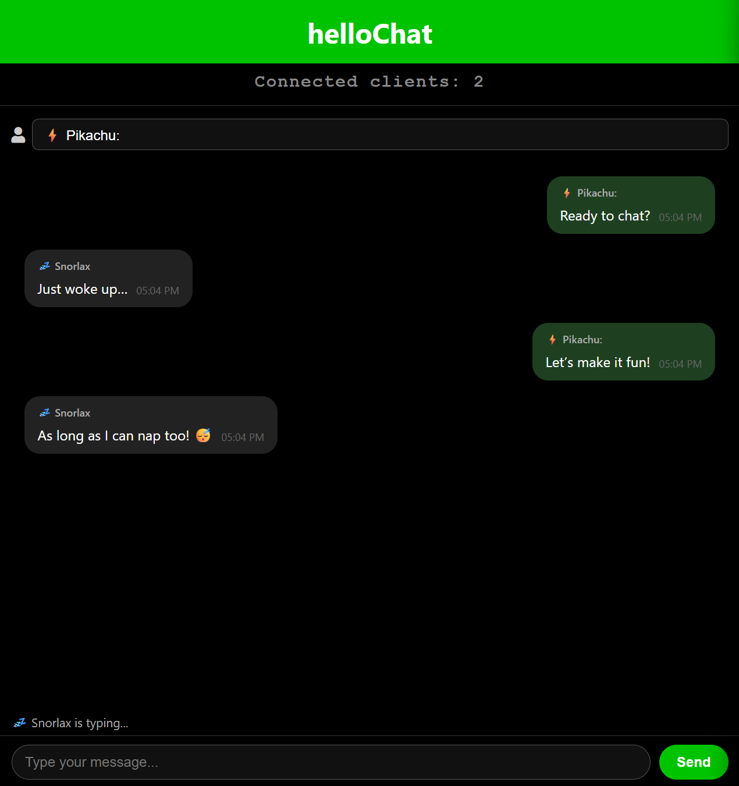

# 💬 helloChat

## 🧾 About

**helloChat** is a simple, real-time web-based chat application built with **Node.js**, **Express**, and **Socket.IO**. It supports multiple connected clients communicating instantly, with typing indicators and audio notifications for incoming messages.

This project demonstrates the basics of WebSocket communication, server-client interaction, and user-friendly real-time updates in a modular, easy-to-understand codebase.

---

## 📸 Demo Screenshot

Here’s a quick look at helloChat in action from Pikachu’s point of view ⚡️

---

## 🧰 Tech Stack

- Node.js & Express.js
- Socket.IO for WebSocket communication
- JavaScript, HTML, and CSS for frontend
- Audio notifications for new messages

---

## ✅ Core Features

---

### 1. Real-time Chat

- Real-time, bi-directional messaging between clients via WebSockets.
- Messages include sender name, text content, and timestamp.
- Frontend displays messages from all connected clients instantly.

---

### 2. Typing Indicator

- Shows when a user is typing.
- Updates dynamically for all connected clients.

---

### 3. Connected Clients Count

- Displays current number of connected users in real-time.

---

### 4. Audio Notification

- Plays a sound when a new message is received by other clients.

---

## 📄 Usage

- Enter your **name** and **message** in the input fields to start chatting.
- Messages sent appear instantly to all connected users.
- See real-time typing indicators when other users are typing.
- Watch the live count of connected users update dynamically.
- New messages from others trigger an audio notification.

---

## 🎵 Audio Notification

- An audio sound plays whenever a new message is received from another user.
- The notification audio file is located at `public/message-tone.mp3`.

---

