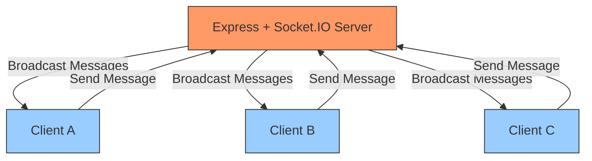
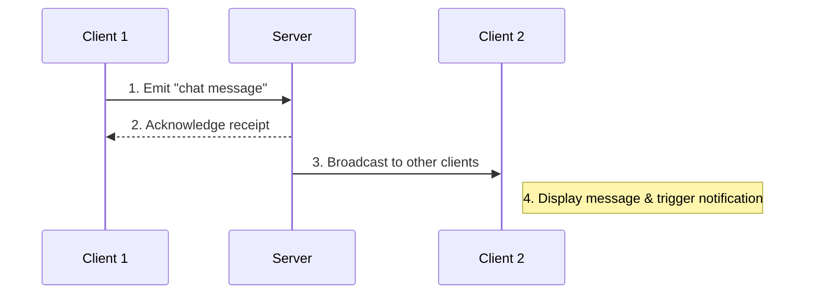

# 💬 helloChat

## 🧾 About

**helloChat** is a simple, real-time web-based chat application built with **Node.js**, **Express**, and **Socket.IO**. It supports multiple connected clients communicating instantly, with typing indicators and audio notifications for incoming messages.

This project demonstrates the basics of WebSocket communication, server-client interaction, and user-friendly real-time updates in a modular, easy-to-understand codebase.

---

## 📸 Demo Screenshot

Here’s a quick look at helloChat in action from Pikachu’s point of view ⚡️

---

## 🧰 Tech Stack

- Node.js & Express.js
- Socket.IO for WebSocket communication
- JavaScript, HTML, and CSS for frontend
- Audio notifications for new messages

---

## ✅ Core Features

---

### 1. Real-time Chat

- Real-time, bi-directional messaging between clients via WebSockets.
- Messages include sender name, text content, and timestamp.
- Frontend displays messages from all connected clients instantly.

---

### 2. Typing Indicator

- Shows when a user is typing.
- Updates dynamically for all connected clients.

---

### 3. Connected Clients Count

- Displays current number of connected users in real-time.

---

### 4. Audio Notification

- Plays a sound when a new message is received by other clients.

---

## 📄 Usage

- Enter your **name** and **message** in the input fields to start chatting.
- Messages sent appear instantly to all connected users.
- See real-time typing indicators when other users are typing.
- Watch the live count of connected users update dynamically.
- New messages from others trigger an audio notification.

---

## 🎵 Audio Notification

- An audio sound plays whenever a new message is received from another user.
- The notification audio file is located at `public/message-tone.mp3`.

---

## 🗂 Architecture & Flow

The helloChat application uses a **centralized Socket.IO server** to manage real-time messaging between multiple clients. The following diagrams illustrate the high-level architecture and message flow.

### 1️⃣ High-Level Architecture

### 2️⃣ Message Flow

### 3️⃣ Core Communication Flow

1. Client initiates WebSocket connection to the server.
2. Server establishes and maintains the connection.
3. Client sends different types of events:
   - Chat messages
   - Typing indicators
   - Connection/disconnection events
4. Server processes incoming events and broadcasts to clients.
5. Receiving clients update their UI accordingly, displaying messages, typing indicators, and updating the connected users count.

---

## Conclusion

helloChat is a straightforward yet effective demonstration of real-time web communication using modern technologies. It provides a solid foundation for building more complex chat applications with additional features like user authentication, message history, and multimedia support. Feel free to explore, modify, and expand upon this project! Happy chatting! 💬🚀

---
